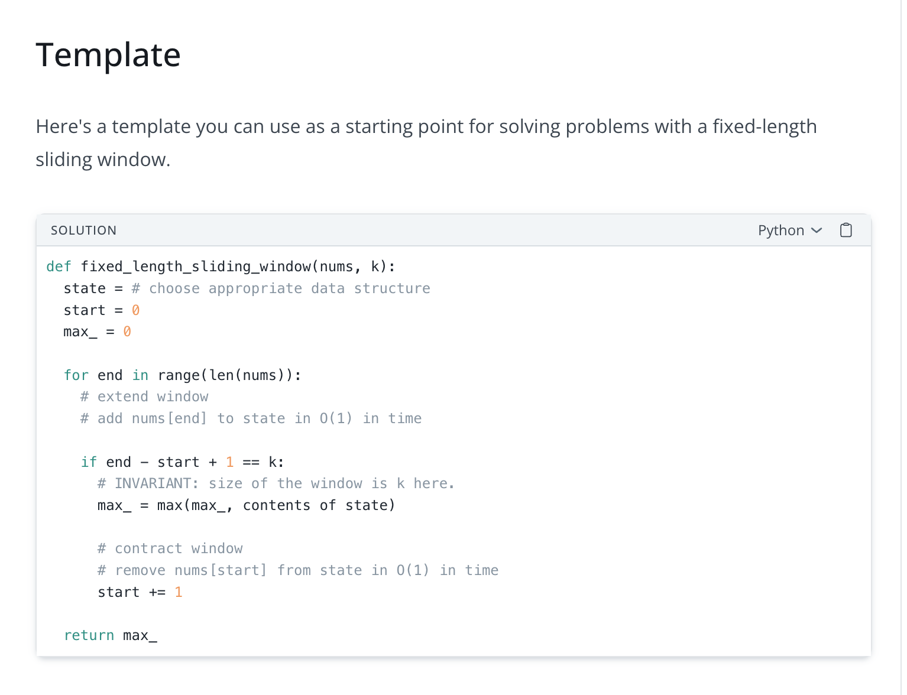

# Solutions

The drill files intentionally contain TODOs rather than answers. After a miss,
rewrite the pattern from memory and keep the solution grounded in the drill
itself.

Example reference for a fixed-length sliding window template:
https://www.hellointerview.com/learn/code/sliding-window/fixed-length

